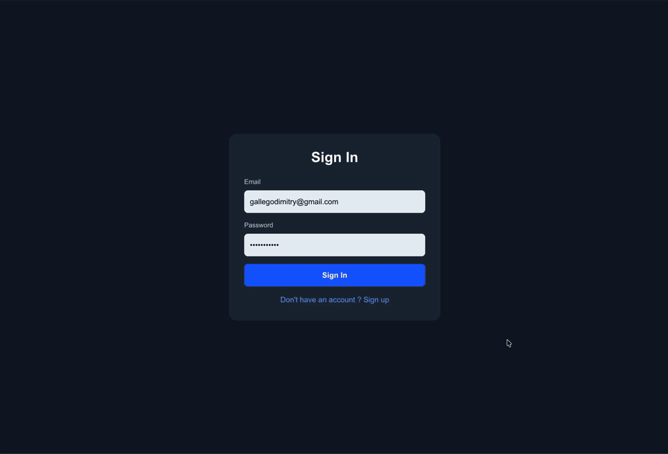

# AI Study Buddy

AI Study Buddy is a full-stack study app that turns notes into practice material using AI.
Upload PDFs/images/text or paste notes, then generate:
- Multiple-choice questions (with explanations)
- Flashcards (short-answer, fill-in-the-blank style)

## Demo



## Features

- AI-powered MCQ and flashcard generation (`gpt-4o-mini`)
- Text and file input (PDF, images, TXT/MD)
- Free-trial gating + subscription access control
- Stripe checkout + webhook-driven subscription sync
- Anki export (`.txt`) and PDF export options
- Score tracking and answer reveal for MCQ practice

## Tech Stack

- Frontend: Next.js 16, React 19, Tailwind CSS 4
- Backend: Next.js App Router API routes
- AI: OpenAI API
- Auth + DB: Supabase
- Billing: Stripe subscriptions
- Testing: Jest + React Testing Library

## Project Docs

- Architecture deep dive: [ARCHITECTURE.md](ARCHITECTURE.md)

## Quick Start

### 1. Install dependencies

```bash
npm ci
```

### 2. Configure environment variables

Create `.env.local` with:

```bash
OPENAI_API_KEY=
NEXT_PUBLIC_SUPABASE_URL=
NEXT_PUBLIC_SUPABASE_ANON_KEY=
SUPABASE_SERVICE_ROLE_KEY=
STRIPE_SECRET_KEY=
STRIPE_PRICE_ID=
STRIPE_WEBHOOK_SECRET=
NEXT_PUBLIC_BASE_URL=http://localhost:3000
```

### 3. Run locally

```bash
npm run dev
```

Open [http://localhost:3000](http://localhost:3000).

## Testing

```bash
npm test
```

## Notes

- Keep operational limits centralized in `src/lib/constants.ts`.
- Route-level request flow and guardrails are documented in `ARCHITECTURE.md`.
